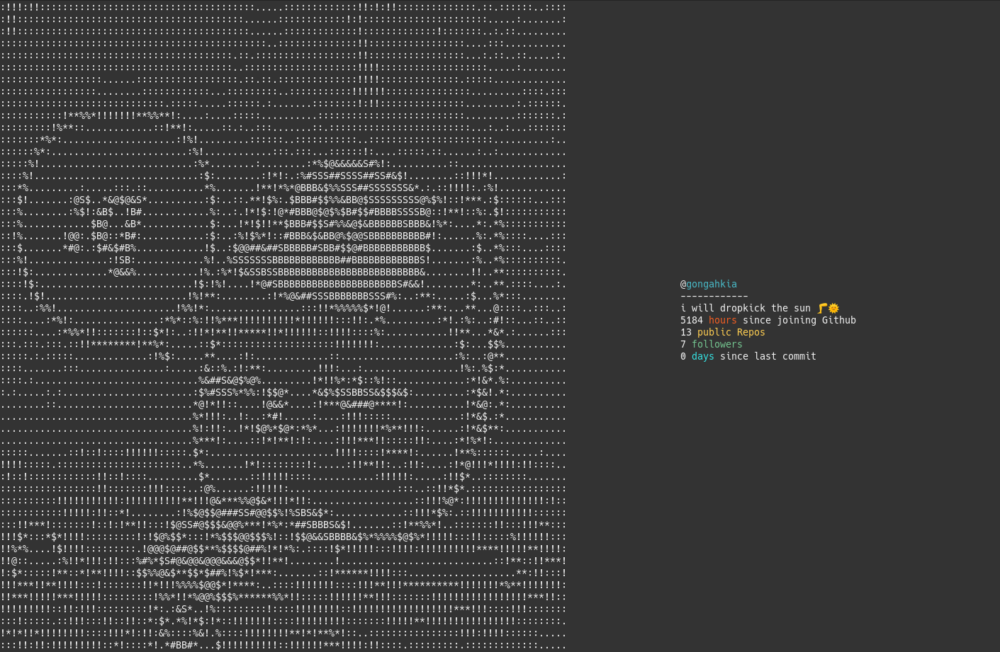

# gitfetch 🛻

**THIS PROGRAM IS UNFINISHED! Don't have any high expectations. Changes will be pushed in the future.**

[Neofetch](https://github.com/dylanaraps/neofetch) for your Github profile.

> ***gitfetch*** is optimized for terminals with a font size 10



# Quick start

## Dependencies
- [Python Pip3+](https://pypi.org/project/pip/)
- [Pillow](https://pypi.org/project/Pillow/)
- [Requests](https://pypi.org/project/requests/)

## Installation

### Windows

```console
```

### MacOS

```console
```

### Linux 

```console
```
